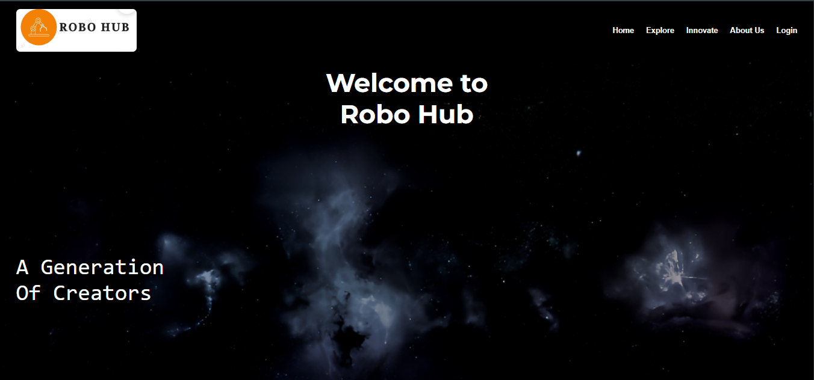

  

# Robo Hub 🚀

Welcome to **Robo Hub** — a platform for students and hobbyists to **share**, **explore**, and **collaborate** on amazing projects!

# Robo Hub 🚀

Welcome to **Robo Hub** — a platform for students and hobbyists to **share**, **explore**, and **collaborate** on amazing projects!

## ✨ Features

- **Upload Projects:** Students can upload their projects with full description, source code, circuit diagrams, and even YouTube links for demonstrations (especially for robotics-related projects).
- **Project Gallery:** Explore a wide range of projects uploaded by others and get inspired!
- **Interactive Comments:** Users can leave comments, feedback, or ask questions on any project.
- **Easy Submission:** A simple form allows users to submit their own projects directly from the website.
- **Support for Robotics Projects:** Include YouTube reference videos to showcase your robotic creations.

## 📸 Screenshots

> _Here are some glimpses of Robo Hub in action:_

### Home Page

---

### Explore Projects

---

### Project Details

---

## 🚀 How It Works

1. Browse the list of available projects.
2. View project details including descriptions, code, and diagrams.
3. Leave your comments, questions, or appreciation.
4. Upload your own project using the provided form.

## 🛠️ Tech Stack

- **Frontend:** HTML, CSS, JavaScript
- **Backend:** (Optional: PHP, Node.js) *(If you have one, mention it here)*
- **Database:** MySQL *(if you used it for storing project data)*

## 📚 Future Enhancements

- Add user authentication for project uploads and comments.
- Like and share features for projects.
- Categorization and search filters for projects.
- Admin panel for moderating uploads and comments.

## 📄 License

This project is free to use and modify!

## 📬 Contact

Want to suggest improvements or collaborate? Reach out!
### techworld1773@gmail.com

---

✨ Thank you for checking out my project!
> Made with ❤️ for all makers, coders, and dreamers.
